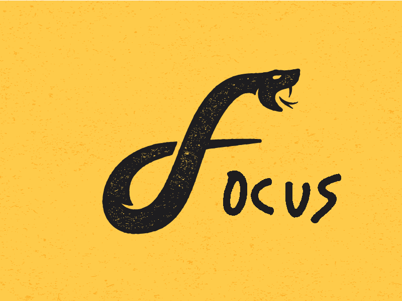

# pytest-focus

Welcome to pytest-focus, a pytest plugin designed to make you focus as you write
test cases until they pass. This tool aims to help you stay on top of making all
the test cases in your test suite pass by relaying which ones fail to pass as
they are run and tested. Notifications will be sent detailing which test case
failed when it happens. Currently supports Linux, MacOS, and Windows 10
operating systems.

## Checks

The following checks are made on the project via these commands:

`pipenv run pytest tests --cov-config pytest.cov --cov`

* The command above checks that the pytest test suite works and that the code
    coverage is not lowered when new additions are added

`pipenv run black **/*.py --check`

* The command above checks that all `.py` python code adheres to the black
  code style

`pipenv run flake8 **/*.py`

* The command above checks that all `.py` python code adheres to the standards
    of `flake8`

`pipenv run pylint **/*.py`

* The command above checks that all `.py` python code adheres to the standards
    of `pylint` and gets rated "10/10"

`mdl README.md`

* The command above checks that the `README.md` adheres to the markdown
    language and its syntax

Failure for these commands to pass will result in the build failing to pass
`Travis CI`. Any build that does not pass this system will not be merged into
the `master` branch.

## Contributors

Thanks goes to these wonderful people ([emoji key](https://allcontributors.org/docs/en/emoji-key)):

<!-- ALL-CONTRIBUTORS-LIST:START - Do not remove or modify this section -->
<!-- prettier-ignore -->
<table><tr><td align="center"><a href="https://github.com/baldeosinghm"> <b>Matthew Baldeosingh</b></a> <a href="https://github.com/inTestiGator/pytest-focus/commits?author=baldeosinghm" title="Code">💻</a> <a href="https://github.com/inTestiGator/pytest-focus/commits?author=baldeosinghm" title="Documentation">📖</a> <a href="#ideas-baldeosinghm" title="Ideas, Planning, & Feedback">🤔</a> <a href="#review-baldeosinghm" title="Reviewed Pull Requests">👀</a></td><td align="center"><a href="http://www.shafferz.com"> <b>Zachary Shaffer</b></a> <a href="https://github.com/inTestiGator/pytest-focus/commits?author=shafferz" title="Code">💻</a> <a href="#ideas-shafferz" title="Ideas, Planning, & Feedback">🤔</a> <a href="#review-shafferz" title="Reviewed Pull Requests">👀</a> <a href="#question-shafferz" title="Answering Questions">💬</a></td><td align="center"><a href="https://alexgaynor.net"> <b>Alex Gaynor</b></a> <a href="https://github.com/inTestiGator/pytest-focus/commits?author=Alex" title="Code">💻</a> <a href="#content-Alex" title="Content">🖋</a> <a href="https://github.com/inTestiGator/pytest-focus/commits?author=Alex" title="Documentation">📖</a> <a href="#infra-Alex" title="Infrastructure (Hosting, Build-Tools, etc)">🚇</a> <a href="#review-Alex" title="Reviewed Pull Requests">👀</a> <a href="#design-Alex" title="Design">🎨</a></td><td align="center"><a href="http://alexander.yarkosky.xyz"> <b>Alexander Yarkosky</b></a> <a href="https://github.com/inTestiGator/pytest-focus/commits?author=Alex-Yarkosky" title="Code">💻</a> <a href="#content-Alex-Yarkosky" title="Content">🖋</a> <a href="https://github.com/inTestiGator/pytest-focus/commits?author=Alex-Yarkosky" title="Documentation">📖</a> <a href="#infra-Alex-Yarkosky" title="Infrastructure (Hosting, Build-Tools, etc)">🚇</a> <a href="#review-Alex-Yarkosky" title="Reviewed Pull Requests">👀</a> <a href="#design-Alex-Yarkosky" title="Design">🎨</a></td></tr></table>

<!-- ALL-CONTRIBUTORS-LIST:END -->

This project follows the [all-contributors](https://github.com/all-contributors/all-contributors) specification. Contributions of any kind welcome!
